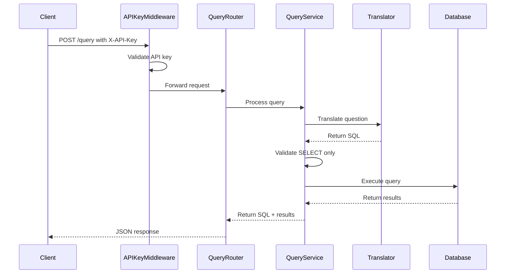

# CloudLinker Architecture

## Overview

CloudLinker is a FastAPI + PostgreSQL platform that enables LLMs to translate natural-language questions into SQL. This document outlines the architecture and design decisions of the project.

## Project Structure

```
backend/
├── src/
│   ├── __init__.py
│   ├── main.py              # FastAPI application entry point
│   ├── settings.py          # Environment configuration
│   ├── db.py               # Database connection and session management
│   ├── translator.py        # Natural language to SQL translator
│   ├── models/             # SQLAlchemy models
│   │   ├── __init__.py
│   │   └── customer.py
│   ├── schemas/            # Pydantic schemas
│   │   ├── __init__.py
│   │   └── customer.py
│   ├── services/           # Business logic layer
│   │   ├── __init__.py
│   │   ├── customer_service.py
│   │   └── query_service.py
│   ├── middleware/         # Middleware components
│   │   ├── __init__.py
│   │   └── api_key.py
│   └── routers/            # API endpoints
│       ├── __init__.py
│       ├── customers.py
│       └── query.py
├── tests/                  # Test suite
│   ├── __init__.py
│   ├── conftest.py
│   ├── test_customers.py
│   └── test_query.py
├── alembic/               # Database migrations
├── requirements.txt       # Python dependencies
└── pytest.ini            # Test configuration
```

## Key Components

### 1. Database Layer

- Uses SQLAlchemy async with asyncpg driver
- Implements repository pattern for data access
- Migrations managed by Alembic
- Connection pooling and health checks enabled

### 2. API Layer

- FastAPI framework with automatic OpenAPI documentation
- Pydantic models for request/response validation
- Dependency injection for database sessions
- CORS middleware configured
- Health check endpoints
- API key authentication middleware

### 3. Service Layer

- Business logic isolated from API layer
- Transaction management
- Error handling and validation
- Clean interface for routers
- Query service for natural language processing

### 4. Testing

- pytest for test framework
- Async test client
- In-memory SQLite for tests
- Fixtures for database sessions
- CI pipeline with GitLab

## Design Decisions

1. **Async First**: All database operations are async for better performance
2. **Type Safety**: Full type hints and Pydantic validation
3. **Clean Architecture**: Clear separation of concerns
4. **Testing**: Comprehensive test coverage with isolated test database
5. **Documentation**: OpenAPI docs and architecture documentation
6. **Security**: API key authentication for all endpoints except health check
7. **Docker**: Multi-container setup with health checks

## Security Considerations

1. Environment variables for configuration
2. No hardcoded secrets
3. Input validation with Pydantic
4. CORS configuration
5. Error handling without exposing internals
6. API key authentication
7. Non-root user in Docker

## Natural Language to SQL Flow



## Future Considerations

1. LLM integration for translation
2. Rate limiting
3. Caching layer
4. Monitoring and logging
5. Docker containerization
6. Kubernetes deployment

---

## Key Files

### `src/main.py`
- The entry point of the FastAPI application
- Initializes and includes routers
- Configures middleware and CORS

### `src/translator.py`
- Translates natural language questions to SQL
- Currently uses hard-coded mappings
- Future: LLM integration

### `src/middleware/api_key.py`
- Validates API keys from request headers
- Protects all endpoints except health check
- Configurable via environment variables

### `src/routers/query.py`
- Handles natural language query requests
- Validates and processes queries
- Returns SQL and query results

### `src/services/query_service.py`
- Manages query translation and execution
- Enforces SELECT-only policy
- Handles database interactions

---

## Application Flow

1. **Request Flow**:
   - Client sends request with API key
   - Middleware validates the key
   - Router processes the request
   - Service layer handles business logic
   - Response returned to client

2. **Validation**:
   - API key validation in middleware
   - Request/response validation with Pydantic
   - SQL validation (SELECT only)

3. **Database Interaction**:
   - Async SQLAlchemy for database operations
   - Connection pooling and retries
   - Transaction management

4. **Health Monitoring**:
   - `/health` endpoint for service status
   - `/test-db` for database connectivity
   - Docker health checks

---

## Future Plans
1. **LLM Integration**:
   - Replace hard-coded mappings with LLM
   - Add query validation and safety checks
   - Implement query optimization

2. **Additional Features**:
   - Query history and caching
   - User management
   - Advanced SQL features

3. **Infrastructure**:
   - Kubernetes deployment
   - Monitoring and logging
   - Automated backups

---

## Collaboration
All contributors are encouraged to review this guide before making changes. Updates to architecture should be documented here to maintain consistency.

---
